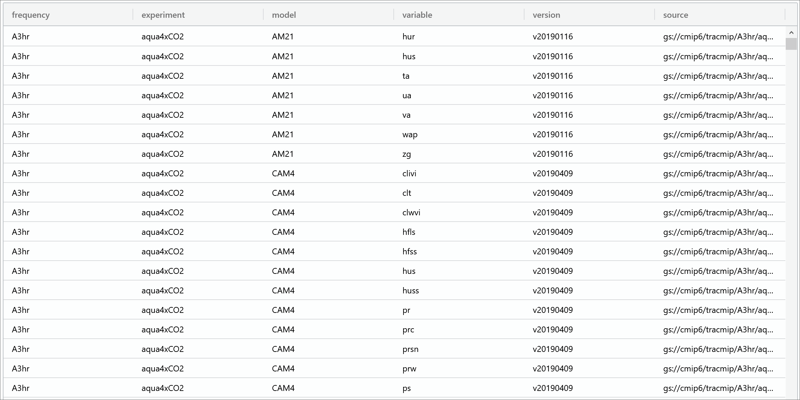

Pangeo Catalog
==============
Pangeo Catalog is an open-source project to enumerate and organize cloud-optimized climate data stored across a variety of providers.
In addition to offering various useful climate datasets in a consolidated location, the project also serves as a means of accessing public ESM data catalogs.

Accessing catalogs using Python
-------------------------------
At the core of the project is a `GitHub repository <https://github.com/pangeo-data/pangeo-datastore>`_ containing several static `intake catalogs <https://intake.readthedocs.io/en/latest/catalog.html>`_ in the form of YAML files.
Thanks to plugins like `intake-esm <https://intake-esm.readthedocs.io/en/latest/>`_ and `intake-xarray <https://intake-xarray.readthedocs.io/en/latest/>`_, these catalogs can contain links to ESM data catalogs or data assets that can be loaded into xarray datasets, along with the arguments required to load them.
By editing these files using Git-based version control, anyone is free to contribute a dataset supported by the available intake plugins.
Users can then browse these catalogs by providing their associated URL as input into intake's ``open_catalog()``; their tree-like structure allows a user to explore their entirety by simply opening the root catalog and recursively walking through it:

.. code-block:: python

  cat = intake.open_catalog("https://raw.githubusercontent.com/pangeo-data/pangeo-datastore/master/intake-catalogs/master.yaml")
  entries = cat.walk(depth=5)

  [key for key in entries.keys()]

These catalogs can also be explored using intake's own ``search()`` method:

.. code-block:: python

  cat_subset = cat.search('cmip6')

  list(cat_subset)

Once we have found a dataset or ESM collection we wish to explore, we can do so without the need of any user inputted argument:

.. code-block:: python

  cat.climate.tracmip()

Accessing catalogs using catalog.pangeo.io
------------------------------------------
For those who don't want to initialize a Python environmemt to explore the catalogs, `catalog.pangeo.io <https://catalog.pangeo.io/>`_ offers a means of viewing them from a standalone web application.
The website directly mirrors the catalogs in the GitHub repository, with previews of each dataset or collection loaded on the fly:

.. image:: _static/pangeo-catalog.png
  :alt: Screenshot of an ESM collection preview on catalog.pangeo.io

From here, users can view the JSON input associated with an ESM collection and sort/subset its contents:

